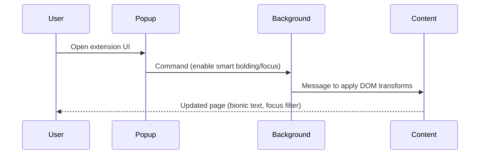

# ReadEase (Day 3 of 30 Days of Product)

ReadEase Chrome extension download + install instructions.

## Live demo
- Visit https://lawrencehua.com/30-days-of-product

## Problem & Solution
- **Problem:** Web reading is slow; clutter and weak anchors hurt pace and focus.
- **Solution:** Extension adds bionic text anchors, focus filtering, TTS, and summarize on any page.

## What’s inside
- Chrome extension source (manifest v3) with background, content, and popup scripts.
- Minimal Next.js host page for download link.
- `.env.example` placeholders to fill with your own keys (if you host).

## Run locally
1. Install deps: `npm install`
2. Copy `.env.example` to `.env` and provide your values
3. Start dev server: `npm run dev`
4. Open `http://localhost:3000`

## Notes
- For demos, use the live link above.
- Repo name: ReadEase (Day 3 of 30 Days of Product)

## Architecture
```mermaid
flowchart TD
  U[User] --> Ext[Chrome Extension (manifest v3)]
  Ext --> BG[background.js]
  Ext --> CT[content.js + content.css]
  Ext --> POP[popup.html/.js/.css]
  BG --> CT: Messaging (start/stop features)
  POP --> BG: User commands (toggle features)
```

## Sequence

